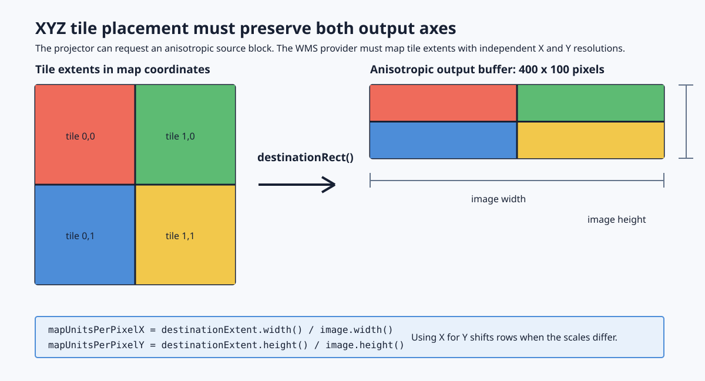
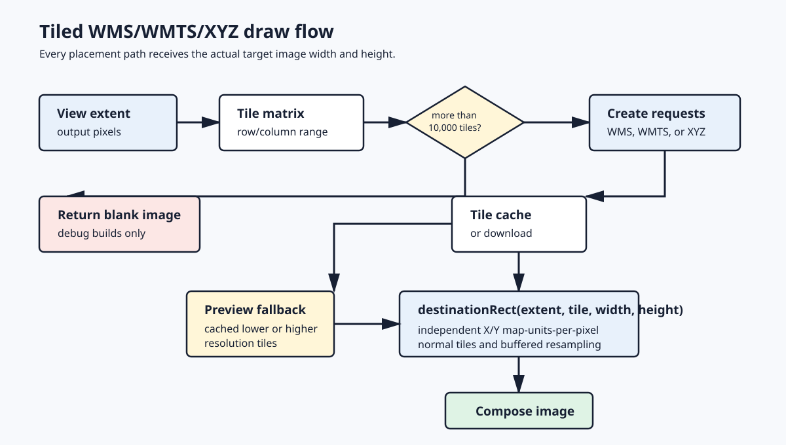

# QGIS Raster Projector Regression

## Summary

QGIS issue [#61792](https://github.com/qgis/QGIS/issues/61792) affects raster layers that must be reprojected across a coordinate discontinuity. A common example is an EPSG:3857 XYZ tile layer rendered in a Pacific-centered or polar project CRS such as EPSG:3832, EPSG:3349, EPSG:5937, or EPSG:3573. At some extents and zoom levels, the raster can appear compressed, shifted, incomplete, or entirely absent while vector layers continue to render correctly.

The regression originates in commit [`ea6db11d74690e84e1392858bb9c0d23a89603c9`](https://github.com/qgis/QGIS/commit/ea6db11d74690e84e1392858bb9c0d23a89603c9), titled "QgsRasterProjection: avoid excessive resolution when reprojecting from EPSG:4326 to EPSG:3857, and misalignment issues." That change addressed a real problem, but its maximum-derived resolution floor made the source-resolution estimate vulnerable to discontinuity artifacts.

## Raster Projector Behavior

`QgsRasterProjector` creates an intermediate source raster from which destination pixels are sampled. Its `Approximate` precision mode builds a matrix of transformed control points and interpolates between them. Its `Exact` mode transforms destination pixels directly. Both modes still need to determine the source extent, source resolution, and intermediate raster dimensions before rendering.

A smaller map-units-per-pixel value requests a finer and therefore larger intermediate source raster. A larger value requests a coarser and smaller raster. An incorrect estimate can consequently cause either excessive allocation or insufficient source detail and coverage.

## Change Introduced by `ea6db11`

The original fix compared the smallest and largest transformed cell-size samples and applied this clamp in the approximate path:

```cpp
if ( myMinSize < 0.1 * myMaxSize )
  myMinSize = 0.1 * myMaxSize;
```

Equivalent clamps were added for `destXRes` and `destYRes` in `extentSize()`.

The intent was to prevent one extremely small transformed sample, especially near high Web Mercator northings, from forcing an excessively fine intermediate raster and a very large allocation. If the minimum was less than one tenth of the maximum, the algorithm raised the minimum to one tenth of the maximum.

## Why It Fails

The clamp assumes that the largest transformed sample represents a valid local scale. That assumption does not hold when the sampled extent crosses a projection wrap boundary or antimeridian.

For example, a short segment near the EPSG:3857 antimeridian can transform into a bounding box that spans nearly the full world width. The resulting maximum cell-size sample is not a measurement of local scale; it is an artifact of the coordinate discontinuity. The fixed `0.1 * maximum` rule then promotes this isolated outlier into the global minimum cell size used for the intermediate raster.

This makes the source request much too coarse. The intermediate raster can contain too few columns or rows to represent the required source coverage correctly, producing compressed, shifted, missing, or zoom-dependent imagery. The existing cap that limits the source raster to ten times the destination dimensions does not prevent this failure because that cap protects against an oversized source raster, while this regression creates an undersized and overly coarse one.

The behavior varies by zoom level because the control-point grid changes with the requested extent. One request may sample across the discontinuity and include the near-world-width outlier, while an adjacent request may not. Vector layers remain correct because they do not use this raster-specific intermediate-grid resolution heuristic.

Later changes through QGIS commit `d583d975f4e54d685ae785a2b0a922ddbbdb63a0` refactored the surrounding code but retained the same fixed minimum/maximum clamp semantics. The regression therefore remains present in that unpatched source base.

## Patched Approach

The new approach separates two concerns that the minimum/maximum clamp combined:

1. **Resolution selection:** use the smallest finite, positive transformed local cell size.
2. **Resource protection:** independently cap the intermediate source raster at ten times the destination width and height.

`ProjectorData::calcSrcRowsCols()` measures horizontal and vertical distances between adjacent transformed control points. It ignores non-finite and non-positive measurements and retains only the smallest valid distance. Larger measurements can represent real local scale variation or a projection discontinuity, but neither is allowed to make the entire intermediate source raster coarser.

`QgsRasterProjector::extentSize()` applies the same rule independently to the X and Y resolutions. It transforms pixel-sized rectangles on the existing 3 by 3 sample grid and selects the smallest finite, positive transformed width and height. Samples that throw a coordinate-transform exception are skipped. The method returns failure if no valid resolution is found or if the resulting dimension would overflow an `int`.

The existing source-dimension limit remains the protection for the problem addressed by #34518. After resolution and source extent are calculated, source rows and columns are each capped at `10 * destination dimension`. A very small valid local scale can therefore request finer sampling without causing unbounded allocation, while a very large wrap artifact cannot reduce source detail or coverage.

This design deliberately does not use percentiles, IQR fences, adaptive floors, or an upper statistic. Those methods can reduce the influence of a discontinuity but still permit the distribution of large samples to raise the selected resolution. Minimum local scale plus a hard dimension cap gives each mechanism one clear invariant: transformed samples determine required detail, and the cap determines the maximum work allowed.

## WMS and XYZ Tile Placement

The independent source-dimension caps can legitimately produce a raster block whose X and Y map-units-per-pixel differ. This exposed a second defect in the WMS provider: `destinationRect()` derived one resolution from `destinationExtent.width() / imagePixelWidth` and used it for both tile axes.

For the EPSG:5937 acceptance extent at scale 1:5,299,070, the projector requested a `19210 x 4065` EPSG:3857 source block. Its X and Y resolutions differed by approximately five percent. Reusing the X resolution for vertical placement accumulated a 114-pixel Y displacement over the test crop even though the projector sampled the correct source coordinates.

`qgswmsprovider-anisotropic-tile-placement.patch` passes both image dimensions to `destinationRect()` and computes independent X and Y map-units-per-pixel values. The matching axis is used for each floor and ceiling operation. The change covers downloaded tiles, cached fallback-resolution tiles, and preview rendering. It does not weaken or remove the source-dimension caps retained for #34518.

Fallback-resolution tile placement uses the actual target image width and height, including the four-pixel buffer created for provider resampling, instead of the original unbuffered request dimensions.

This provider correction is required together with the projector patch. Projector source partitioning, Exact precision, and changing `tilePixelRatio` do not address the tile-composition error.

### Per-Axis Tile Geometry

`destinationRect()` converts each tile's map extent into pixel bounds in the target `QImage`. Before the fix it received only the image width, derived a single map-units-per-pixel value, and used that value for both axes. That is correct only when the requested map extent and output buffer have matching aspect ratios.

The patched function receives both `imagePixelWidth` and `imagePixelHeight`. It calculates `mapUnitsPerPixelX` from extent width and image width, and `mapUnitsPerPixelY` from extent height and image height. The X value is used for the left/right bounds; the Y value is used for the top/bottom bounds. Pixel bounds still round outward, preserving the original no-gap behavior between adjacent tiles.



### Provider Draw Paths

The same geometry contract is used in every tiled provider path:

- Tiles available at the selected resolution use `destinationRect(effectiveViewExtent, tileExtent, image.width(), image.height())` before composition.
- Preview and cache-only rendering search one and two lower resolutions, then one higher resolution. `fetchOtherResTiles()` receives the same effective extent and both actual image dimensions before placing its fallback tiles.
- The tile renderer path passes its target image's width and height to the same helper.
- When provider resampling creates a four-pixel buffered image, `effectiveViewExtent` and `image.width()/image.height()` describe that buffered target together. Passing the unbuffered requested dimensions would introduce an additional placement error.



### Debug Request Guard

The request ceiling is a debug-build diagnostic guard, not a production throttling policy. Once the provider determines the tile row and column range, debug builds return an empty image and publish a status message only when a non-MBTiles draw would require more than `10000` tiles. MBTiles requests remain exempt. The guard previously limited valid large reprojected draws at 256, then 1024; it is now 10000.

The limit applies before tile URLs are generated or downloads begin. It does not alter tile selection, placement geometry, cache behavior, or the source-dimension caps that protect #34518. `RelWithDebInfo` keeps this debug-only check and its diagnostics compiled into the deployment image.

### Deterministic Provider Regression

`testAnisotropicXyzBlock` creates a temporary local XYZ pyramid at zoom 1. Its red, green, blue, and yellow 256-pixel tiles form a 2 by 2 map grid. The WMS provider requests the complete grid as an intentionally anisotropic `400 x 100` block and verifies one sample in each quadrant. A vertical calculation based on the X resolution puts one or more samples in the wrong tile; independent-axis placement preserves all four expected colors.

The test is network-independent and tests the composition layer directly. It complements, rather than replaces, the EPSG:5937 World Imagery acceptance render: the synthetic tiles make a pixel-placement defect deterministic, while the production render verifies the complete reprojection and remote tile workflow.

## Validation Requirements

The focused QGIS regression test uses an offline synthetic raster provider, so correctness does not depend on an XYZ server or network access. It verifies:

- Minimum local X and Y scale selection for EPSG:3857 output from EPSG:3832, EPSG:5937, and EPSG:3573 extents.
- Stable behavior for neighboring extents and a consecutive EPSG:3832 zoom extent.
- A dateline-adjacent EPSG:3857 source request in both `Approximate` and `Exact` modes.
- Valid, non-empty output blocks and source dimensions bounded to ten times the destination dimensions.
- A symmetric EPSG:4326 to EPSG:3857 request in both precision modes, covering the allocation limit introduced for #34518.

The focused WMS provider regression creates a local 2 by 2 XYZ grid with a distinct color in each tile. It requests the full grid as an anisotropic `400 x 100` raster block and verifies all four quadrant samples. This fails when horizontal resolution is reused vertically and passes when tile placement uses independent axis resolutions.

The test target `test_core_rasterprojector` compiles and passes in the QGIS Qt 6 build dependency image with a persistent Debug build and ccache. Real WMS or XYZ rendering remains an acceptance test for the final server image, not the deterministic correctness gate.

The Docker build uses QGIS source commit `d583d975f4e54d685ae785a2b0a922ddbbdb63a0` and applies `qgsrasterprojector.cpp.patch`, `qgswmsprovider-debug-tile-limit.patch`, and `qgswmsprovider-anisotropic-tile-placement.patch`. The debug-only tile-request guard is retained with its ceiling raised from 256 to 10000. A `RelWithDebInfo` build is required for the added `QgsDebugMsgLevel` diagnostics to be compiled into QGIS. Setting `QGIS_DEBUG=5` at runtime controls message filtering but cannot restore diagnostics omitted by a `Release` build.

The image `arctic-qgis:anisotropic-tile-placement-d583d975` was accepted with the following checks:

- The local 2 by 2 anisotropic XYZ block returned all four expected colors.
- A full-world provider block and an equivalent local crop had a `0,0` phase shift; the unpatched provider shifted the crop by `0,-114`.
- EPSG:5937 renders centered at longitude -169, latitude 66 completed without renderer errors at scales 1:2,323,956 and 1:5,299,070.
- The narrow render retained `0,0` registration against the previously passing image.
- The wide render registered within `1,0` pixels of the QGIS 3.10 oracle, placed St. Lawrence Island near pixel `(742,572)`, and contained neither the lower-left white wedge nor a wrap seam.
- The vector coastline overlay aligned with the imagery at scale 1:5,299,070.